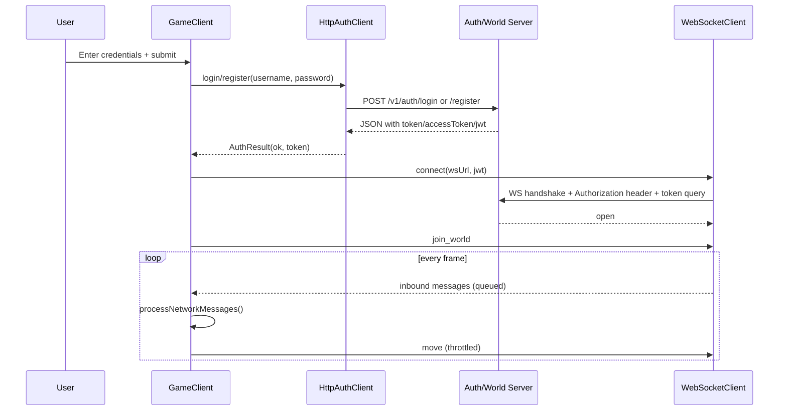

# API Integration

## Server Endpoints

Configured in code:

- Auth base URL: `http://localhost:8080` (`GameClient` creates `HttpAuthClient`)
- Login endpoint: `POST /v1/auth/login`
- Register endpoint: `POST /v1/auth/register`
- World socket: `ws://localhost:8080/v1/world/ws`

## HTTP Authentication Flow

`HttpAuthClient` sends JSON:

```json
{
  "username": "player1",
  "password": "secret"
}
```

Token extraction is tolerant. It accepts any of:

- `token`
- `accessToken`
- `jwt`

If HTTP is non-2xx, network fails, response is invalid JSON, or no token exists, auth fails and UI stays on Auth screen.

## WebSocket Connection Flow

Connection implementation details (`WebSocketClient::connect`):

- Builds URL from `ws://localhost:8080/v1/world/ws`
- If JWT exists, appends query string fallback: `?token=<jwt>`
- Also sets handshake header: `Authorization: Bearer <jwt>`
- Starts a background thread running `websocketpp::client::run()`

Status behavior:

- Open handler: `Connected to world socket`
- Close handler: `World socket closed`
- Fail handler: `WebSocket fail: <reason>`
- Send failure: `Send failed: <reason>`

## Inbound Message Handling

`GameClient::processNetworkMessages()` is schema-tolerant:

1. Detect local identity from `selfId` or (`type == "welcome"` and `playerId`).
2. Snapshot form: any payload with `players` array replaces `remotePlayers`.
3. Event form:
   - `type == "player_left"` removes `playerId`
   - `type == "player_update"` or `type == "player_joined"` upserts player data
4. Fallback parse attempts to treat any object as a player update.

Accepted player id fields:

- `id`
- `playerId`
- `username`

Accepted position fields:

- Nested: `position.x`, `position.y`, `position.z`
- Flat: `x`, `y`, `z`

## Outbound Messages

On first world-frame with active connection:

```json
{
  "type": "join_world",
  "character": "Warrior"
}
```

Movement sends at most every 0.05s (~20 Hz):

```json
{
  "type": "move",
  "character": "Warrior",
  "position": {
    "x": 1.0,
    "y": 0.5,
    "z": -2.0
  }
}
```

## Threading and Safety

- Network thread only pushes raw payload strings into a mutex-protected queue.
- Main thread drains queue via `pollMessages()` and mutates `WorldState`.
- This avoids direct cross-thread writes to gameplay state.

## Sequence Diagram


