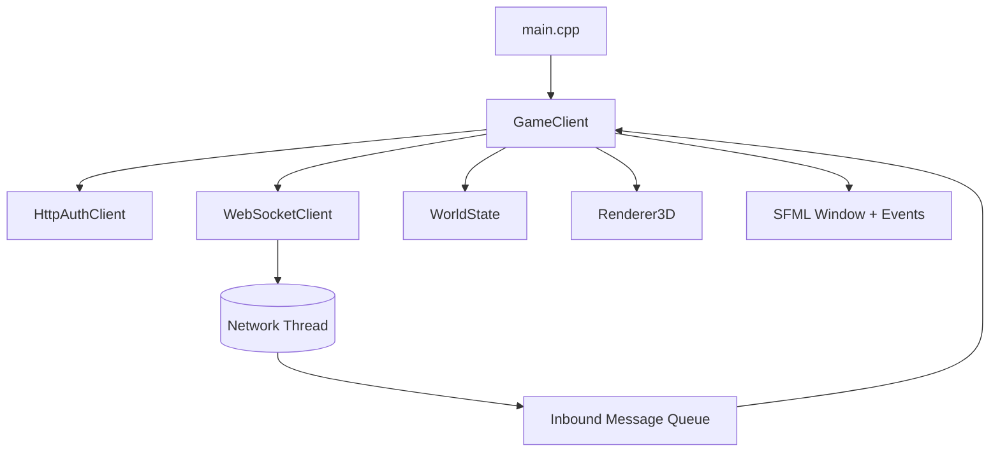
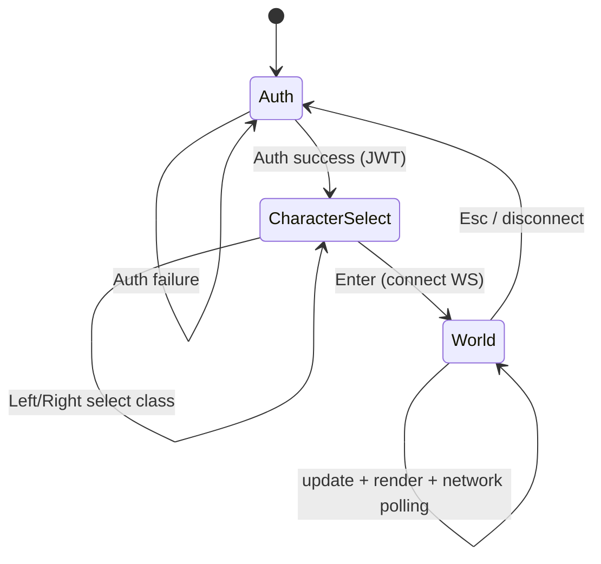
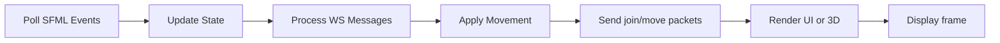

# Architecture Overview

## High-Level Design

The client is organized around a single main loop (`GameClient`) that coordinates:

- UI and state transitions (`Auth -> CharacterSelect -> World`)
- HTTP authentication (`HttpAuthClient`)
- WebSocket networking (`WebSocketClient`)
- World simulation data (`WorldState`)
- 3D rendering (`Renderer3D`)

## Runtime Components

## State Machine

## Frame Lifecycle

## Data Ownership

- `WorldState` is owned by `GameClient` and mutated on the main thread.
- `WebSocketClient` owns a mutex-protected inbound queue populated on a network thread.
- `GameClient::processNetworkMessages()` drains queue data and updates `WorldState`.
- Renderer is stateless across frames except OpenGL state; it receives `const WorldState&`.
