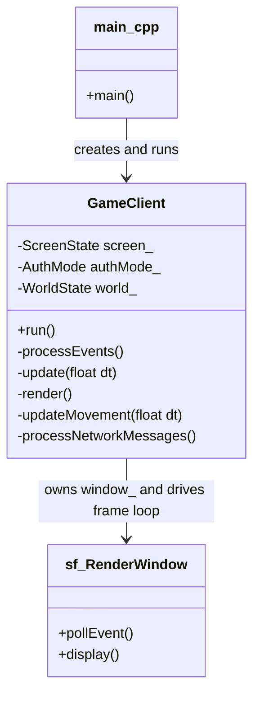
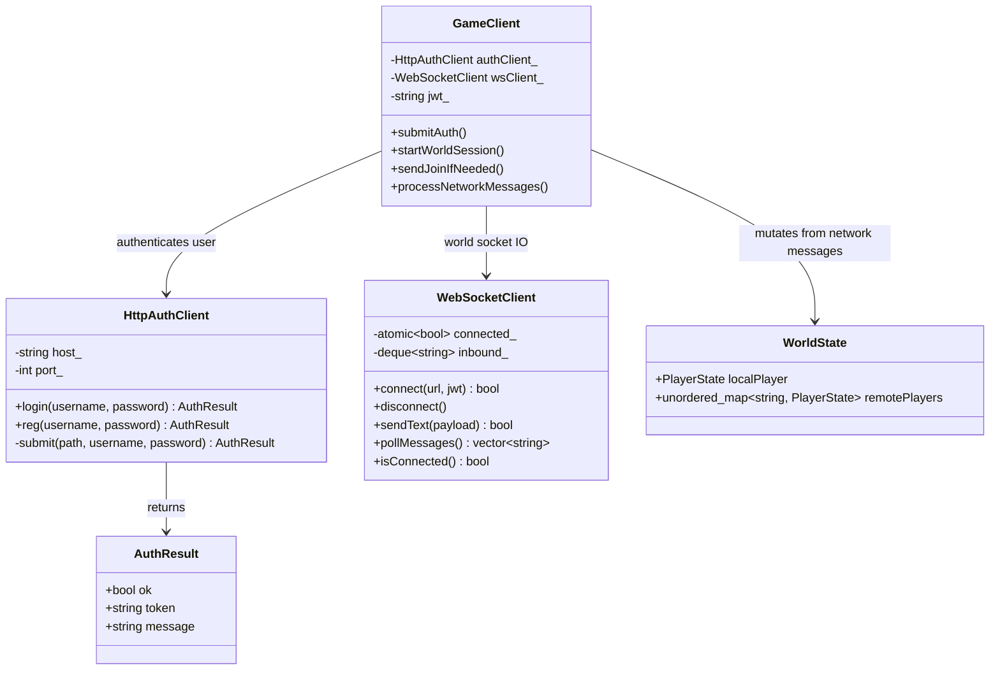
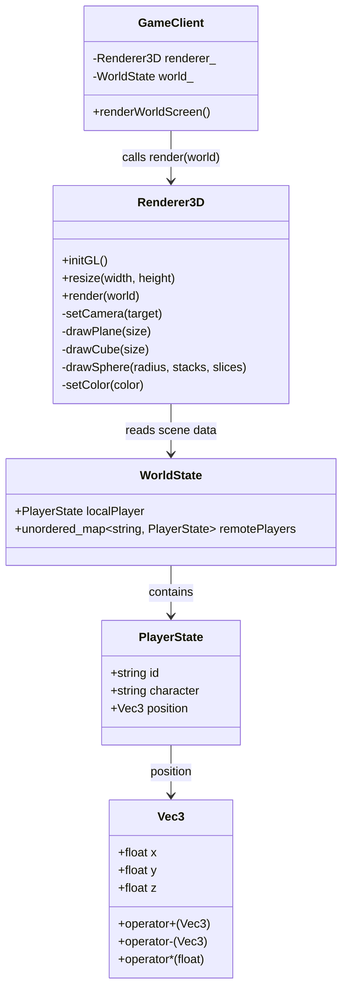

# Class Diagrams (Mermaid)

## 1) Main Game Loop Flow

```mermaid
classDiagram
    class main_cpp {
      +main()
    }

    class GameClient {
      -ScreenState screen_
      -AuthMode authMode_
      -WorldState world_
      +run()
      -processEvents()
      -update(float dt)
      -render()
      -updateMovement(float dt)
      -processNetworkMessages()
    }

    class sf_RenderWindow {
      +pollEvent()
      +display()
    }

    main_cpp --> GameClient : creates and runs
    GameClient --> sf_RenderWindow : owns window_ and drives frame loop
```

## 2) Client-Server Communication

```mermaid
classDiagram
    class GameClient {
      -HttpAuthClient authClient_
      -WebSocketClient wsClient_
      -string jwt_
      +submitAuth()
      +startWorldSession()
      +sendJoinIfNeeded()
      +processNetworkMessages()
    }

    class HttpAuthClient {
      -string host_
      -int port_
      +login(username, password) AuthResult
      +reg(username, password) AuthResult
      -submit(path, username, password) AuthResult
    }

    class WebSocketClient {
      -atomic~bool~ connected_
      -deque~string~ inbound_
      +connect(url, jwt) bool
      +disconnect()
      +sendText(payload) bool
      +pollMessages() vector~string~
      +isConnected() bool
    }

    class AuthResult {
      +bool ok
      +string token
      +string message
    }

    class WorldState {
      +PlayerState localPlayer
      +unordered_map~string, PlayerState~ remotePlayers
    }

    GameClient --> HttpAuthClient : authenticates user
    GameClient --> WebSocketClient : world socket IO
    GameClient --> WorldState : mutates from network messages
    HttpAuthClient --> AuthResult : returns
```

## 3) Renderer Architecture

```mermaid
classDiagram
    class GameClient {
      -Renderer3D renderer_
      -WorldState world_
      +renderWorldScreen()
    }

    class Renderer3D {
      +initGL()
      +resize(width, height)
      +render(world)
      -setCamera(target)
      -drawPlane(size)
      -drawCube(size)
      -drawSphere(radius, stacks, slices)
      -setColor(color)
    }

    class WorldState {
      +PlayerState localPlayer
      +unordered_map~string, PlayerState~ remotePlayers
    }

    class PlayerState {
      +string id
      +string character
      +Vec3 position
    }

    class Vec3 {
      +float x
      +float y
      +float z
      +operator+(Vec3)
      +operator-(Vec3)
      +operator*(float)
    }

    GameClient --> Renderer3D : calls render(world)
    Renderer3D --> WorldState : reads scene data
    WorldState --> PlayerState : contains
    PlayerState --> Vec3 : position
```
